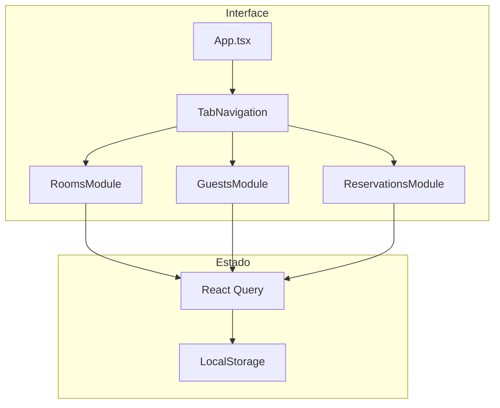

# Sistema de Reservas de Hotel

## Visão Geral

Criar um sistema de reservas de hotel com React, TypeScript, Material-UI e persistência em LocalStorage. O sistema terá 3 módulos (Quartos, Hóspedes, Reservas) com navegação por abas e tema verde/azul.

## Tarefas Concluídas

- [x] Criar projeto Vite, instalar dependências, configurar aliases e tema MUI
- [x] Implementar componentes compartilhados (TabNavigation, DataTable, FormField) e StorageService
- [x] Módulo Quartos: tipos, schemas, hooks, RoomForm e RoomList
- [x] Módulo Hóspedes: tipos, schemas, hooks, GuestForm e GuestList
- [x] Módulo Reservas: tipos, schemas, hooks, ReservationForm e ReservationList
- [x] Integração final no App.tsx com navegação por abas

## Arquitetura Geral



## 1. Setup do Projeto

Criar projeto Vite com React + TypeScript e instalar dependências:

```bash
npm create vite@latest hotel-reservation -- --template react-ts
cd hotel-reservation
npm install @mui/material @mui/icons-material @emotion/react @emotion/styled
npm install @tanstack/react-query react-hook-form @hookform/resolvers zod
npm install -D vitest @testing-library/react @testing-library/user-event jsdom
```

Configurar aliases no `tsconfig.json` e `vite.config.ts`.

## 2. Estrutura de Pastas

```
src/
├── modules/
│   ├── rooms/
│   │   ├── components/
│   │   │   ├── RoomForm.tsx
│   │   │   ├── RoomList.tsx
│   │   │   └── index.ts
│   │   ├── hooks/
│   │   │   ├── useRooms.ts
│   │   │   └── index.ts
│   │   ├── schemas/
│   │   │   └── room.schema.ts
│   │   ├── types/
│   │   │   └── room.types.ts
│   │   └── index.ts
│   ├── guests/
│   │   ├── components/
│   │   ├── hooks/
│   │   ├── schemas/
│   │   ├── types/
│   │   └── index.ts
│   └── reservations/
│       ├── components/
│       ├── hooks/
│       ├── schemas/
│       ├── types/
│       └── index.ts
├── shared/
│   ├── components/
│   │   ├── TabNavigation/
│   │   ├── FormField/
│   │   ├── DataTable/
│   │   └── ConfirmDialog/
│   ├── hooks/
│   │   └── useLocalStorage.ts
│   └── lib/
│       ├── queryClient.ts
│       └── storage.ts
├── styles/
│   └── theme.ts
├── types/
│   └── common.types.ts
├── App.tsx
└── main.tsx
```

## 3. Tipos e Entidades

### Room (Quarto)

```typescript
type RoomType = 'basic' | 'modern' | 'luxury';
type BedType = 'single' | 'king' | 'queen';
type RoomAvailability = 'occupied' | 'available' | 'maintenance' | 'cleaning';

interface Room {
  id: string;
  number: string;
  capacity: number;
  type: RoomType;
  pricePerNight: number;
  hasMinibar: boolean;
  hasBreakfast: boolean;
  hasAirConditioning: boolean;
  hasTV: boolean;
  beds: BedType[];
  availability: RoomAvailability;
}
```

### Guest (Hóspede)

```typescript
interface Guest {
  id: string;
  firstName: string;
  lastName: string;
  cpf: string;
  email: string;
}
```

### Reservation (Reserva)

```typescript
interface Reservation {
  id: string;
  roomId: string;
  guestId: string;
  checkIn: string;
  checkOut: string;
  status: 'active' | 'completed' | 'cancelled';
}
```

## 4. Tema MUI (Verde e Azul)

```typescript
// src/styles/theme.ts
const theme = createTheme({
  palette: {
    primary: {
      main: '#1976d2',      // Azul
      light: '#42a5f5',
      dark: '#1565c0',
    },
    secondary: {
      main: '#2e7d32',      // Verde
      light: '#4caf50',
      dark: '#1b5e20',
    },
  },
});
```

## 5. Componentes Principais

### Módulo Quartos

- **RoomForm**: Formulário com React Hook Form + Zod para cadastro/edição
- **RoomList**: Tabela MUI com colunas (número, tipo, preço, disponibilidade, ações)

### Módulo Hóspedes

- **GuestForm**: Formulário de cadastro com validação de CPF
- **GuestList**: Tabela com nome, sobrenome, CPF

### Módulo Reservas

- **ReservationForm**: Select de quarto + hóspede + datas
- **ReservationList**: Tabela com Chips coloridos para status

## 6. Persistência (LocalStorage)

Criar um serviço genérico de storage que simula operações CRUD:

```typescript
// src/shared/lib/storage.ts
class StorageService<T extends { id: string }> {
  constructor(private key: string) {}
  
  getAll(): T[]
  getById(id: string): T | undefined
  create(item: Omit<T, 'id'>): T
  update(id: string, item: Partial<T>): T
  delete(id: string): void
}
```

## 7. Hooks com React Query

Cada módulo terá hooks que usam o StorageService:

```typescript
// Exemplo: src/modules/rooms/hooks/useRooms.ts
export function useRooms(): UseQueryResult<Room[]>
export function useRoom(id: string): UseQueryResult<Room>
export function useCreateRoom(): UseMutationResult
export function useUpdateRoom(): UseMutationResult
export function useDeleteRoom(): UseMutationResult
```

## 8. Navegação por Abas

Componente principal com MUI Tabs para alternar entre módulos:

```typescript
// App.tsx
<TabNavigation
  tabs={[
    { label: 'Quartos', component: <RoomsModule /> },
    { label: 'Hóspedes', component: <GuestsModule /> },
    { label: 'Reservas', component: <ReservationsModule /> },
  ]}
/>
```

## Ordem de Implementação

1. Setup do projeto e configurações
2. Tema e componentes compartilhados
3. Serviço de storage genérico
4. Módulo de Quartos (tipos, schemas, hooks, componentes)
5. Módulo de Hóspedes
6. Módulo de Reservas
7. Integração final e testes
